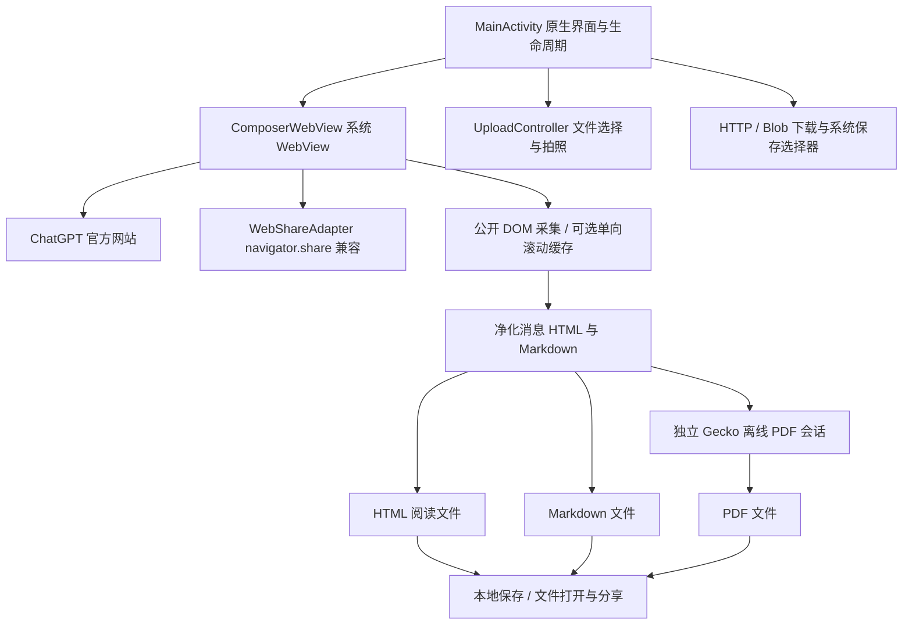

# ChatGPT Nova：全部功能、实现方式与改善审查资料

> 整理日期：2026-10-06。用途：可独立交给其他 ChatGPT 阅读、评估改善方案。
> 本文记录当前代码实际行为，区分已实现、已验证和建议；不是新版本发布说明。

## 1. 软件身份与当前基线

- 仓库：[DevenirTwilight/ChatGPT-Nova](https://github.com/DevenirTwilight/ChatGPT-Nova)。工作分支：`feature/export-conversation`。
- 本文审查代码基线：`eaeadce574189ea7f704c075ee556792f8a70258`。最近已交付 APK 的应用源码：`190113f9387cd55e9dc3eb816a57d666840a9b03`；后续主要是交付打包和文档变更。
- 非官方 Android 网页容器，打开 `https://chatgpt.com/`，并非 OpenAI 官方 App。
- 正式包名 `com.example.chatgptnova`；debug 包名另加 `.debug`。可与官方 App 同时安装。
- 当前版本 `1.4.0-scroll-trial`，versionCode 14。相同版本的试验构建通过诊断 `buildRevision` 区分。
- Android 最低 API 26（Android 8.0），compileSdk/targetSdk 35，Java 17。
- 本次请求只整理文档，没有修改应用、撤掉 Gecko、生成新 APK 或合并 main。

**当前实际架构：聊天和登录仍是 Android 系统 WebView；GeckoView 只负责把净化后的离线 HTML 生成 PDF。** 因此更换 PDF 引擎不会让网页中未采集的历史自动出现。

此前讨论提出“撤掉专用于 PDF 的 Gecko、复用系统 WebView 打印”的轻量化方向，**目前只是建议，尚未实施**。下面将其作为待审查方案，不描述成已完成修复。

## 2. 结构总览

本软件没有自建聊天后端、模型推理、独立会话数据库或自有账号系统。模型选择、项目、历史列表、回复生成、订阅及网站提供的工具等，来自官网；是否出现取决于官网、账号与地区。不能把官网功能列为 Nova 自己实现的原生功能，也不能保证未来官网变化后继续兼容。

## 3. 浏览、界面、导航及生命周期

| 功能 | 当前实现 | 边界 / 注意事项 |
| --- | --- | --- |
| 启动与品牌 | AndroidX SplashScreen，自有 Nova 普通、自适应和单色图标 | 原生主题基于 Material.Light.NoActionBar，不是完整原生聊天 UI |
| 顶部栏 | Java 动态构建布局：标题、当前域名、溢出菜单，加载进度条 | 显示主机名及非默认端口，不展示完整私密会话地址 |
| 常用菜单 | 刷新、ChatGPT 首页、浏览器打开、设置；明确未登录才显示登录 | 官网 DOM 状态不明确时不猜测账号状态 |
| 导出入口 | 可信 ChatGPT 页面显示试用导出入口；采集脚本再检查会话路由 | 不保证首页或其他页面可导出 |
| 设置 | 退出当前账号、清除登录与网站数据、登录帮助、关于 | 退出入口只在明确登录时出现 |
| 系统布局 | 处理状态栏、导航栏、显示切口、键盘 Insets，页面随键盘调整 | 各厂商键盘和 WebView 版本仍需真实设备验证 |
| 返回键 | 有网页历史则后退，否则结束 Activity；兼容 API 33 返回回调 | 不是原生页面栈 |
| 页面恢复 | 保存 WebView 状态，序列化大小不超过 256 KiB；否则恢复安全 HTTPS 地址 | 不构成完整草稿、聊天历史或附件备份 |
| 错误界面 | 主文档网络错误提供重试、首页、外部浏览器 | HTTP 错误保留网站原页面并提示，避免覆盖登录网站提示 |
| 渲染器崩溃 | 取消关联任务、销毁旧 WebView、重建并打开首页 | 当前网页临时状态可能丢失 |
| 生命周期 | 页面结束与暂停时刷新 Cookie 到磁盘；销毁时关闭关联任务 | 下载不是持久后台任务，无断点续传保障 |

WebView 开启 JavaScript、DOM Storage、数据库和第一方/第三方 Cookie，保留系统默认 User-Agent。开启 Safe Browsing、拒绝混合内容；不绕过 TLS 证书错误。关闭文件 URL 访问，允许受控 content URI 文件上传；不启用任意脚本弹窗或多窗口。媒体播放设置不要求每次额外用户手势，但相机/麦克风授权仍受原生权限边界约束。

HTTPS 页面主要留在 Nova；HTTP 交给外部浏览器。拒绝 `file:`、`content:`、`javascript:`、`data:` 主页面跳转。`intent:` 链接清除 component、selector、原始 flags 等，再限制 action/category 与 fallback；不允许借其加载本地或脚本页面。其他外部 scheme 通过 Android 外部 Intent 处理。

**当前溢出菜单没有独立“粘贴文本”和“分享当前页面”项。** 历史设计文档可能描述过这些入口；应以当前 `showMenu` 源码为准。输入和网页 Web Share 兼容能力仍存在。

## 4. 登录、账号与数据清理

### 应用内登录

打开官网公开登录页面 `https://chatgpt.com/auth/login`，认证交互由官网完成。Nova WebView 使用自己的 Cookie 与网站存储，和系统浏览器、官方 App 相互独立。

账号菜单状态只查询页面公开可见的 profile / login 控件，返回 `signed_in`、`signed_out`、`unknown`。查询有约 350 ms 原生等待上限，并核对请求序号、WebView 实例与地址，防止旧结果更新新页面。它不是服务端认证检查，不读取密码、认证 token 或私有登录接口。

### Google 与外部浏览器登录

遇到 Google 登录页面时提供帮助，可以在浏览器打开一个新的官方 ChatGPT 登录页。优先 Custom Tabs / 可用浏览器，必要时使用系统选择器。

不会转发捕获的 OAuth state，不建立 Cookie 同步，不把外部浏览器登录成功当成 Nova 已登录。这条路线用于绕开部分嵌入式登录限制，但不等同实现“浏览器登录后自动回到 Nova 已认证”。

### 退出和清理

确认后取消页面任务、清缓存/历史/表单、销毁 WebView、删除 WebStorage 和 Nova Cookie；等待 Cookie 删除回调、flush 后才重建并打开首页，同时清理临时相机照片。

这主要是 **Nova 本地登录与网站数据清除**，不是调用官网服务端退出全部设备接口，也不清除系统浏览器或官方 App 的数据。Manifest 关闭 Android 备份；不自行上传账号资料。

## 5. 输入与长文本粘贴兼容

`ComposerWebView` 包装可信 ChatGPT 页面中非密码编辑器的 `InputConnection`，改善输入法提交大段、多行文本时的卡顿、换行与光标问题。

- 对正常小段输入保留原始路径。较大提交（至少 1024 UTF-16 单元）或多行提交走批量兼容路径；正在 composing 等情况保留原输入法语义。
- 支持普通 `commitText`、新 API 重载和 API 34 `replaceText`。
- 优先将一整段纯文本通过可取消的 `ClipboardEvent('paste')` 提交给网页编辑器，让编辑器管理模型、选区和撤销。
- 未被编辑器消费时，textarea 使用原型 setter 并发送 input/change；contenteditable 使用转义文本片段、`execCommand('insertHTML')` 或 Range 插入回退。
- 等待网页回调与输入法线程屏障期间，排队处理后续输入、删除、选区和 batch 操作，降低乱序风险。
- 页面导航或销毁使旧队列失效，不向新页面重放上一页面文本。
- 页面完成后还安装普通 paste 兼容逻辑，只在目标编辑器处理用户的粘贴事件。

IME 路径处理输入法主动交来的文本，不主动读取系统剪贴板，不记录正文、不自动点击发送。上述回退仍依赖官网编辑器结构；成功插入 DOM 不天然证明所有未来编辑器模型正确同步，需用真实编辑、继续输入、撤销和发送结果复测。

## 6. 文件上传、拍照、相机与麦克风

### 上传与拍照

`UploadController` 接管 WebView 文件选择：系统 `ACTION_OPEN_DOCUMENT`、MIME 类型/扩展名转换、单选/多选、图片选择及拍照。

- 同时只保留一个文件回调；新选择会取消旧回调。
- 选择结果限制为 content URI，合并 ClipData 并去重，多选数量有限制（最多 100 个 ClipData 项）；单选只返回首项。
- 相机需要 Android 运行时授权，通过 FileProvider 提供缓存 JPEG URI，并设置读写临时授权。权限拒绝时可转入文件选择。
- 成功且非空照片保留供网页读取；取消或空照片删除。初始化时清理七天前照片，清除账号数据时主动删除。
- Nova 不另做照片压缩、OCR、文件解析或服务端上传；真正附件提交由官网完成。

### 网页媒体权限

只有 HTTPS `chatgpt.com` 及其子域、默认端口且无 userinfo 的可信页面，才可能申请相机/麦克风原生权限。只映射网页 AUDIO_CAPTURE / VIDEO_CAPTURE，按实际 Android 授权结果授予子集；其他资源和非可信页面拒绝。导航、取消或销毁会结束待处理授权。

上传、媒体、下载、分享、导出各自的可信源规则不完全一样；审查时应逐项看源码，不能把允许子域的媒体规则套到只允许精确主域的导出桥接上。

## 7. 下载与文件保存

所有保存通过系统 Storage Access Framework 的 `ACTION_CREATE_DOCUMENT`，写入用户选定的 content URI，不申请广泛存储权限。

| 类型 | 实现 | 限制 |
| --- | --- | --- |
| HTTPS 附件下载 | `HttpDownload` 单 IO 线程、64 KiB 流式写入、30 秒连接/读取超时 | 手动处理最多 8 次重定向与循环检测；拒绝降级 HTTP |
| 认证 Cookie | 仅在初始可信 ChatGPT 源与后续精确同源时携带 | 一旦跨源，之后即使跳回也不再携带 Cookie；无代理服务 |
| blob 下载 | `BlobDownload` 读取用户点击的确切 blob，通过 FileReader 按 64 KiB 编码、逐块回调写入 | 上限 256 MiB；准备和每块有有限轮询，不一次编码全部文件 |
| 文件名 | `DownloadNames` 解析标准文件名及 UTF-8 filename*，兼容 blob anchor 的 download 属性 | 替换路径分隔符和控制字符，最多 160 字符 |
| 完成反馈 | 检查写入、关闭和可用长度，显示成功/失败 | 不是独立验证下载内容语义；失败可能留下不完整目标文件 |

当前下载没有 WorkManager/前台服务持久化、断点续传、应用退出后继续下载或自动删除所有失败目标文件的保证。blob 在导航时取消；HTTP 不依赖当前 DOM，但数据清除/Activity 销毁会取消它。

## 8. 网页分享兼容

`WebShareAdapter` 仅为官网缺失的 `navigator.share` 提供兼容；已有原生实现不覆盖。

使用 AndroidX WebKit 的 origin 限制 WebMessageListener，尽量在 document-start 注入；不支持时根据能力回退或不暴露原生接口。只接受受控主页面、可信源的标题/文本/ChatGPT 链接，校验长度、消息类型、活动页面和用户交互；不做文件 Web Share。

Android 端使用 `ACTION_SEND` + 系统 chooser。通过一次性 PendingIntent 与非导出 receiver 识别选择目标；取消/导航/销毁结束 Promise。选中目标只能证明 chooser 选择完成，不能证明对方应用已发送消息。

不会自动附加私密会话地址、查询账号数据、扫描接收方内容，也不提供任意网站可调用的通用 JavaScriptInterface。

## 9. 三种导出格式：当前实际数据源

入口：“导出聊天历史（试用）”。主要选项是 **快速导出当前已加载消息，不滚动**；另可选择单向历史扫描。

导出脚本读取官网公开 DOM，路由限制为普通 `/c/...` 或项目会话 `/g/.../c/...`。等待页面可采集，并拒绝部分生成中/不稳定/身份冲突状态。

### 消息识别与正文转换

1. 读取可见的 `[data-message-author-role]` 用户/助手节点。
2. 对没有作者节点的独立助手块，补采显式助手 article，或同时带 `data-turn=assistant` 与 `conversation-turn-` testid 的容器。
3. 排除隐藏、含已有作者、嵌套重复候选及不明确角色，按 DOM 顺序处理。
4. 提取 Markdown 正文和受支持的显式进度块；缺少 Markdown 包装时有限回退；过滤按钮等控件，净化成白名单 HTML 和 Markdown。
5. 保存 ID、role、messageType、HTML、Markdown。不能确定 channel 时标记 assistant-unknown，不凭文字猜测“进度”。

**不按正文相同、相似度或文本 hash 去重。** 两条真实消息可以内容相同。重复稳定 ID 会拒绝；快速采集缺 ID 可保留正文并警告，滚动跨窗口缺 ID 仍失败，不能伪造稳定身份。

限制包括最多 1000 条消息、约 200 万正文字符、8 MiB JSON 结果。原生层解码、检查状态/地址、前后签名核对，拒绝过期结果。签名用于检测本次变化，不是独立完整性证据。

`read-only-dom` 表示这条采集路径读取公开 DOM；不是权限错误，也不意味着技术路线不可行。可选扫描会修改滚动位置及临时采集状态，不能把整个扫描说成“网页完全不变”。

### HTML / Markdown / PDF

| 格式 | 实现 | 当前边界 |
| --- | --- | --- |
| HTML | 自包含阅读版，角色分段、代码与表格样式、范围提示和页脚；CSP 禁止外部资源/脚本 | 净化后的内容，不是原网页存档；不包含图片/附件原文件 |
| Markdown | 从 DOM 转换正文，保留代码块、表格等受支持结构 | 不是恢复网站原始 Markdown 源码；复杂数学/富文本需核对效果 |
| PDF | 同一净化 HTML 交给 GeckoView `saveAsPdf`，写缓存、校验页数后直接系统保存 | Gecko 仅渲染已采集内容；不会补采历史，也不提供附件备份 |

HTML/Markdown 可选择保存、打开文件、分享文件、复制诊断，通过 FileProvider 临时 URI 授权。缓存导出文件在生成过程中清理七天前文件；用户已保存到外部位置的文件不由该缓存清理覆盖。

### Gecko PDF 具体实现与成本

- 固定依赖 `org.mozilla.geckoview:geckoview:140.0.20250707120347`，使用 Mozilla Maven 源。固定版本是 compileSdk 35 兼容选择，不应称为当前最新 Firefox 引擎。
- PDF 时延迟创建共享 GeckoRuntime，单次创建私密 GeckoSession；禁用 JavaScript、调试与 console 输出。
- 只允许本地 data HTML，拒绝新会话/外部导航；渲染视图附着到 Activity，并隐藏辅助功能焦点。
- 等文档成功加载后调用 `saveAsPdf()`，后台写文件，上限 128 MiB，再用 Android PdfRenderer 检查可解析且有页面。
- 生成约 90 秒超时，可取消；成功、失败或销毁关闭会话和视图。共享 runtime 保留复用。
- 诊断包含引擎、版本、字节数和页数，错误分类 G01–G08。页数验证不证明文本没有截断或历史完整。

以前曾使用系统 WebView PrintDocumentAdapter / PrintManager 的“保存为 PDF”。当前 Gecko 路径替换了这条打印 UI。评估轻量方案时可重新比较，但不能直接假定系统打印有等价“静默生成 PDF 后直接 SAF 保存”的公开能力。

## 10. 可选单向滚动扫描

为应对官网长会话的虚拟化/懒加载，在扫描过程中逐窗口缓存，不只读取结束时还留在 DOM 的节点。

- 从顶部向下；从底部向上；中间开始先定位底部再向上。**只规划一个方向，不自动上下来回，不强制第二遍。**
- 完成或取消后恢复原滚动位置。这种恢复可能表现为跳回底部，不代表又开始一轮扫描。
- 初始步幅约 0.8 个视口；相邻消息窗口必须有稳定 ID 重叠。缺少重叠时缩小步幅重试，最多 5 次，仍失败则停止。
- 用稳定 ID 缓存、检查正文/角色冲突并维护顺序关系；不按相似文本合并。
- 检测历史区域内公开加载指示、消息列表/正文/位置/范围变化，等待稳定再采集；正文里的装饰旋转不当加载指示。
- 每窗口最多约 30 秒，扫描最多 10 分钟或 1200 步；有准备宽限、轮询、取消和临时状态清理。
- 当前相关错误包括 H02 身份不足、H03 重叠不足、H06 未稳定等；成功时仍 `historyCompleteness:not-proven`。

用户曾反馈：开头已经采齐当时所有节点，后续滚动计数不增加，但耗时约 85 秒。快速入口已提供；扫描仍可能浪费时间。是否能安全提前结束，应结合真实虚拟化与加载证据设计，不能仅凭某一步计数未增加就声称全历史已齐。

到顶/到底、窗口重叠、顺序一致、缓存条数，都只说明扫描行为。它们不是和独立权威历史逐条一致的证明。

## 11. 错误诊断与缺失文字定位

### 导出诊断

可复制 JSON，包含版本/提交、Android/WebView、阶段/错误码/耗时、路由类型、消息数、字符数、角色计数、缺失/重复 ID 数量、过滤计数、滚动步骤和等待变化等。

不复制聊天正文、真实消息 ID、会话地址、Cookie 或认证凭据。`ariaHidden` 等过滤数量是节点级统计，不能解释成“漏了这么多条聊天”。

### 进度结构发现

`progress-discovery.js` 检查公开作者、turn、作者外正文等结构，输出有限 DOM 特征样本和计数。它辅助发现漏采机制，不自动把所有作者外文字当助手消息。

### 定位缺失文字

入口在“导出诊断”弹窗中的“定位缺失文字”。先在官网显示目标，再输入 4–160 UTF-16 单元的独特片段；只搜索当前挂载页面，不滚动、不持久化输入。

有节点/字符/耗时/样本上限，输出角色、可见性、祖先链结构和是否在实际转换结果中，不输出查询正文或真实 ID。按钮、输入框、脚本、iframe 等排除。`L01_NOT_FOUND` 只说明本次受限搜索没匹配，不能证明历史不存在；长句标点、跨块或虚拟化都可能影响。

## 12. 实际验证与尚未完成事项

### 已有证据

- 用户真机环境：Android 36，WebView `153.0.8010.36`。
- 早期单次 DOM 导出曾只有 7 条并大段缺失，滚动版本曾因加载/布局未稳定报 H06；这是真实失败，不能被合成测试覆盖掉。
- 用户后续逐条对照报告普通主文本改善；29/30 的差异定位为可见助手进度漏采。这些内容比对是用户转述的其他 ChatGPT 检查，本文不冒称本环境独立解析了未取得的真实 HTML。
- 真机定位与结构诊断发现：某窗口 12 个普通作者，但有 13 个可见 turn，其中一个明确助手 turn 没有作者节点。旧 article 限制漏掉此类容器；当前补采范围已扩展到显式助手 conversation-turn。
- 当前应用源码 CI [37509953925](https://github.com/DevenirTwilight/ChatGPT-Nova/actions/runs/37509953925)：构建、lint、原签名核对；浏览器 17 单快照、32 滚动、19 进度、18 定位场景；Android 35/36 各 18 项通过。
- 两套模拟器生成 PDF 各 99,166 bytes、5 页 Letter，实际检出首尾、进度测试标记、代码与表格。PDF 不是仅凭成功回调判定。
- ARM64 [交付 CI 37512229753](https://github.com/DevenirTwilight/ChatGPT-Nova/actions/runs/37512229753)：保留原应用文件，移除其他 ABI、原证书重签、对齐和签名检查；独立逐字节核对 172 个保留文件。

### 仍未验证 / 未实现

1. 当前最终补采修正对用户原目标进度的正文、前后顺序，尚缺新包真实导出逐条复测；不能宣称已经恢复那一条。
2. 项目内真实长会话完整历史仍未独立证明，所有成功诊断保留 `not-proven`。
3. 附件原文件、图片原文件未包含；元数据也未做完整审计。不能称完整会话备份。
4. 助手 commentary/工具进度没有通用、全网站结构覆盖保证。
5. 跨窗口缺稳定 ID 仍可能 H02，有限 fallback 不解决通用身份问题。
6. 旧捕获路线的 403 未修复或重测。新 DOM 路线绕开原调用，不等于旧问题消失。
7. ARM64 裁剪包没有冒用 x86_64 模拟器结果作为 ARM64 真机运行证明。
8. 独立消息 ID/分支/正文基准校验未成为成品 UI；官方数据导出可作为候选基准，但必须先检查其是否包含目标进度与当前会话分支，不能直接比较总数。

结论：三格式试用实现与受控集成检查已经完成，具备继续有界改善的基础；“真实完整会话导出”验收未完成。

## 13. 包体、构建、依赖与交付

| 当前产物 | 原始大小 | 解释 |
| --- | ---: | --- |
| 四架构通用 APK | 681,095,398 bytes，约 650 MiB | 同时含 ARM64、ARM32、x86、x86_64 Gecko 库 |
| 通用 APK 的交付 ZIP | 300,645,094 bytes，约 287 MiB | 外层压缩减少下载体积，不减 APK 安装内容 |
| 手机优先 ARM64 APK | 178,491,277 bytes，约 170 MiB | 同一应用源码、同版号、同证书，仅去掉其他 ABI |
| ARM64 交付 ZIP | 84,711,177 bytes，约 81 MiB | 下载后解压 APK，不能把 ZIP 大小当安装大小 |

ARM64 Gecko 原生文件未压缩合计约 153.9 MiB，是主要成本；仅为 PDF 引入完整引擎，明显改变轻量容器定位。四架构打包解释了 650 MiB，但 ABI 分包不能消除保留引擎本身的重量。

历史核对 Mozilla Firefox 157.0.1 官方 ARM64 APK 下载大小为 134,275,592 bytes（约 128 MiB）。这是同为 APK 的比较，不是安装后含数据/缓存占用比较；不同版本、引擎打包与压缩策略也不同。没有本次独立核对的官方 ChatGPT APK 数字，不能编造具体大小。

构建使用 AGP 8.7.3、Gradle 8.9、Java 17、SDK/build-tools 35。直接 AndroidX 依赖包括 core 1.15.0、core-splashscreen 1.0.1、browser 1.8.0、webkit 1.12.1；实际解析版本可能被传递依赖提升，审查时应查看依赖树。

release 的 `minifyEnabled` 和 `shrinkResources` 当前都关闭。启用 R8/资源缩减可评估，但不能假定它会自动削减大型 Gecko 原生库，也不能无验证开启后发布。

使用原签名证书，私钥/密码通过本地忽略配置或 GitHub Secrets，不写入文档。debug 为独立包；测试夹具只放测试 APK，不混入交付主包。Manifest 不申请广泛存储权限；库最终合并权限应以 merged manifest/最终 APK 为准。

Gecko/MPL 许可和来源在仓库及 APK assets 内；历史 marked 许可也保留。当前关于界面没有完整第三方许可阅读入口，可作为改善项。lint 只对 Gecko 捆绑未使用的 NotificationUtil 特定警告作局部例外，不关闭应用权限检查。

工作流：`dom-trial.yml` 为当前验证；`build-from-zip.yml` 记录标准构建/升级/输入验证；`export-validation.yml` 对应旧路线；`large-apk-delivery.yml` 与 `gecko-arm64-delivery.yml` 用于原签名产物交付。修复提交只验证、不自动发布 APK；无本批公开 GitHub Release。

## 14. 旧路线与当前路线不能混淆

仓库仍保留 `capture.js`、`core.js`、`pagination.js`、`run.js` 和 marked 等旧方案文件及旧报告。当前 trial 路径使用 `dom-trial.js`、`scroll-trial.js`、`progress-discovery.js`、`locate-text.js`；**不安装旧捕获器**。

旧文件存在不证明正在截获 fetch、调用旧接口或读取内部状态。未来维护可评估隔离/删除死代码，但先确认历史测试与证据依赖，避免误删复现资料。README 和早期设计文档有历史阶段描述；当前行为以应用源码和最近证据为准。

## 15. 供审查的主要源码与资料

以下源码链接固定到本文审查基线，避免工作分支未来改变导致解释错位。

| 文件 | 作用 |
| --- | --- |
| [app/src/main/java/com/example/chatgptnova/MainActivity.java](https://github.com/DevenirTwilight/ChatGPT-Nova/blob/eaeadce574189ea7f704c075ee556792f8a70258/app/src/main/java/com/example/chatgptnova/MainActivity.java) | 主界面、菜单、登录、权限、导航、输入脚本与生命周期 |
| [app/src/main/java/com/example/chatgptnova/ComposerWebView.java](https://github.com/DevenirTwilight/ChatGPT-Nova/blob/eaeadce574189ea7f704c075ee556792f8a70258/app/src/main/java/com/example/chatgptnova/ComposerWebView.java) | IME 批量文本兼容与输入队列 |
| [app/src/main/java/com/example/chatgptnova/UploadController.java](https://github.com/DevenirTwilight/ChatGPT-Nova/blob/eaeadce574189ea7f704c075ee556792f8a70258/app/src/main/java/com/example/chatgptnova/UploadController.java) | 文件选择、拍照和临时照片管理 |
| [app/src/main/java/com/example/chatgptnova/HttpDownload.java](https://github.com/DevenirTwilight/ChatGPT-Nova/blob/eaeadce574189ea7f704c075ee556792f8a70258/app/src/main/java/com/example/chatgptnova/HttpDownload.java) | HTTPS 流式下载、重定向与 Cookie 边界 |
| [app/src/main/java/com/example/chatgptnova/BlobDownload.java](https://github.com/DevenirTwilight/ChatGPT-Nova/blob/eaeadce574189ea7f704c075ee556792f8a70258/app/src/main/java/com/example/chatgptnova/BlobDownload.java) | blob 分块读取与写入 |
| [app/src/main/java/com/example/chatgptnova/DownloadNames.java](https://github.com/DevenirTwilight/ChatGPT-Nova/blob/eaeadce574189ea7f704c075ee556792f8a70258/app/src/main/java/com/example/chatgptnova/DownloadNames.java) | 下载文件名解析与净化 |
| [app/src/main/java/com/example/chatgptnova/WebShareAdapter.java](https://github.com/DevenirTwilight/ChatGPT-Nova/blob/eaeadce574189ea7f704c075ee556792f8a70258/app/src/main/java/com/example/chatgptnova/WebShareAdapter.java) | 网页分享兼容与受限消息桥 |
| [app/src/main/java/com/example/chatgptnova/ConversationExport.java](https://github.com/DevenirTwilight/ChatGPT-Nova/blob/eaeadce574189ea7f704c075ee556792f8a70258/app/src/main/java/com/example/chatgptnova/ConversationExport.java) | 采集入口、三格式、保存与诊断 UI |
| [app/src/main/java/com/example/chatgptnova/GeckoPdfExporter.java](https://github.com/DevenirTwilight/ChatGPT-Nova/blob/eaeadce574189ea7f704c075ee556792f8a70258/app/src/main/java/com/example/chatgptnova/GeckoPdfExporter.java) | Gecko PDF 会话、流保存与校验 |
| [app/src/main/assets/export/dom-trial.js](https://github.com/DevenirTwilight/ChatGPT-Nova/blob/eaeadce574189ea7f704c075ee556792f8a70258/app/src/main/assets/export/dom-trial.js) | 消息选择、fallback 与正文转换 |
| [app/src/main/assets/export/scroll-trial.js](https://github.com/DevenirTwilight/ChatGPT-Nova/blob/eaeadce574189ea7f704c075ee556792f8a70258/app/src/main/assets/export/scroll-trial.js) | 单向扫描、窗口重叠、缓存及稳定等待 |
| [app/src/main/assets/export/progress-discovery.js](https://github.com/DevenirTwilight/ChatGPT-Nova/blob/eaeadce574189ea7f704c075ee556792f8a70258/app/src/main/assets/export/progress-discovery.js) | 进度相关公开 DOM 结构发现 |
| [app/src/main/assets/export/locate-text.js](https://github.com/DevenirTwilight/ChatGPT-Nova/blob/eaeadce574189ea7f704c075ee556792f8a70258/app/src/main/assets/export/locate-text.js) | 缺失文字定位与转换对照 |
| [app/build.gradle](https://github.com/DevenirTwilight/ChatGPT-Nova/blob/eaeadce574189ea7f704c075ee556792f8a70258/app/build.gradle) | SDK、依赖、版本与构建配置 |
| [app/src/main/AndroidManifest.xml](https://github.com/DevenirTwilight/ChatGPT-Nova/blob/eaeadce574189ea7f704c075ee556792f8a70258/app/src/main/AndroidManifest.xml) | 组件、权限和 FileProvider 声明 |
| [app/src/main/res/xml/file_paths.xml](https://github.com/DevenirTwilight/ChatGPT-Nova/blob/eaeadce574189ea7f704c075ee556792f8a70258/app/src/main/res/xml/file_paths.xml) | FileProvider 文件范围 |
| [app/lint.xml](https://github.com/DevenirTwilight/ChatGPT-Nova/blob/eaeadce574189ea7f704c075ee556792f8a70258/app/lint.xml) | 局部第三方 lint 例外 |
| [docs/dom-export-trial.md](https://github.com/DevenirTwilight/ChatGPT-Nova/blob/eaeadce574189ea7f704c075ee556792f8a70258/docs/dom-export-trial.md) | 试用说明、错误码及历次验证 |
| [docs/export/independent-validation.md](https://github.com/DevenirTwilight/ChatGPT-Nova/blob/eaeadce574189ea7f704c075ee556792f8a70258/docs/export/independent-validation.md) | 独立历史校验设计 |
| [docs/third-party-gecko.md](https://github.com/DevenirTwilight/ChatGPT-Nova/blob/eaeadce574189ea7f704c075ee556792f8a70258/docs/third-party-gecko.md) | Gecko 来源、版本与许可 |
| [docs/DESIGN-PASTE.md](https://github.com/DevenirTwilight/ChatGPT-Nova/blob/eaeadce574189ea7f704c075ee556792f8a70258/docs/DESIGN-PASTE.md) | 输入兼容历史设计与证据 |
| [docs/DESIGN-SHARE.md](https://github.com/DevenirTwilight/ChatGPT-Nova/blob/eaeadce574189ea7f704c075ee556792f8a70258/docs/DESIGN-SHARE.md) | 分享历史设计，入口需与当前源码核对 |
| [docs/LOGIN-CALLBACK-RESEARCH.md](https://github.com/DevenirTwilight/ChatGPT-Nova/blob/eaeadce574189ea7f704c075ee556792f8a70258/docs/LOGIN-CALLBACK-RESEARCH.md) | 外部登录回调限制研究 |
| [docs/V1-REVIEW.md](https://github.com/DevenirTwilight/ChatGPT-Nova/blob/eaeadce574189ea7f704c075ee556792f8a70258/docs/V1-REVIEW.md) | 原网页容器审查记录 |
| [README.md](https://github.com/DevenirTwilight/ChatGPT-Nova/blob/eaeadce574189ea7f704c075ee556792f8a70258/README.md) | 软件使用说明 |
| [AGENTS.md](https://github.com/DevenirTwilight/ChatGPT-Nova/blob/eaeadce574189ea7f704c075ee556792f8a70258/AGENTS.md) | 用户授权范围与交接约定 |
| [docs/handoff/latest.md](https://github.com/DevenirTwilight/ChatGPT-Nova/blob/eaeadce574189ea7f704c075ee556792f8a70258/docs/handoff/latest.md) | 最近交付、失败和未验证边界 |
| [docs/handoff/REVIEW.md](https://github.com/DevenirTwilight/ChatGPT-Nova/blob/eaeadce574189ea7f704c075ee556792f8a70258/docs/handoff/REVIEW.md) | 审查与接续状态 |
| [tools/feasibility/REPORT.md](https://github.com/DevenirTwilight/ChatGPT-Nova/blob/eaeadce574189ea7f704c075ee556792f8a70258/tools/feasibility/REPORT.md) | 早期可行性记录，历史结论需按阶段阅读 |
| [.github/workflows/dom-trial.yml](https://github.com/DevenirTwilight/ChatGPT-Nova/blob/eaeadce574189ea7f704c075ee556792f8a70258/.github/workflows/dom-trial.yml) | 当前 CI 验证流程 |
| [.github/workflows/gecko-arm64-delivery.yml](https://github.com/DevenirTwilight/ChatGPT-Nova/blob/eaeadce574189ea7f704c075ee556792f8a70258/.github/workflows/gecko-arm64-delivery.yml) | ARM64 原签名交付流程 |

## 16. 给其他 ChatGPT 的审查任务（可直接使用）

请根据本说明和链接源码，审查 ChatGPT Nova 的全部功能及实现方式。先区分当前真实实现、历史方案、已通过的受控检查、用户报告及尚未验证的内容，再提出改善建议；不要把合成测试当作真实完整历史验收。

用户希望保留 Markdown、HTML、PDF 三种格式，减少包体与扫描耗时，可靠保存可见助手进度，提供可理解且脱敏的报错诊断。同时保留原有登录、长文本输入、文件上传/下载、相机/麦克风和网页分享兼容能力。相关修复集中成批，不为每次反馈疯狂递增版本；测试包可直接交付，不要求公开 Release。

请优先回答：

1. 仅为 PDF 引入 Gecko 的架构是否值得？在三格式不减少的条件下，比较系统 WebView 打印、其他 PDF 生成方法和保留 Gecko 的功能、维护、兼容、体积与保存交互成本。撤掉 Gecko 尚未实施，请先给方案，不当作当前完成状态。
2. 能否利用当前已挂载 DOM 快速完成常见导出，同时只在确有历史加载需要时扫描？如何安全减少滚动、等待和恢复造成的耗时，而不虚假标注完整？
3. 无作者但明确助手 turn 的补采是否足够保守？如何处理缺稳定 ID 的跨窗口身份与顺序，而不按文字去重、不把署名/按钮或后续引用当成原消息？
4. 如何建立独立校验，分别证明主对话、助手进度、附件元数据、附件/图片原文件的覆盖？基准本身缺 commentary 或分支不一致时怎么办？
5. 现有 WebView 原生桥、可信源边界、输入回退、权限、下载与清理是否有具体缺陷？只报告能从源码或证据支持的问题，并给复现/验证办法。
6. 如何整理职责、旧脚本与重复历史文档，降低维护复杂度，避免一个改善破坏登录、输入或文件能力？

请输出：按优先级排列的问题清单；每项引用对应文件/机制和证据边界；推荐架构及被放弃方案的理由；一个最小改动批次；所需真实设备验证与验收标准。先讨论，再实现，不直接大改或发布。不要要求为每段普通对话生成迁移提示词。

若后续需要压缩上下文或迁移会话，按 AGENTS.md 将必要交接更新到 GitHub 当前工作分支、提交并推送，提供文档链接及下一会话提示词；不只提供本地下载文件。
